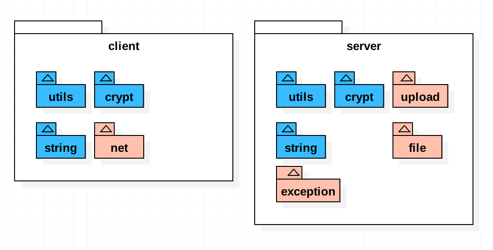

febs 库是一些常用的工具的合集;

支持browser端与node server端;

> browser支持 IE9及以上浏览器.

> browser支持常用的jquery操作, 可以在大多数场景下替代jquery.

browser详见 [reamde](./browser/README.md)

febs 包含browser端与server端代码.
独立的 browser端代码在 [febs-browser](https://www.npmjs.com/package/febs-browser) 库中


# Install

Use npm to install:

```js
npm install febs --save
```

# nodejs

以下列方式使用

```js
var febs = require('febs');

//
febs.string.replace();
```

# browser

以下列方式使用

> copy directory `node_modules/febs/browser/dist/febs` to client

```html
<meta http-equiv="X-UA-Compatible" content="IE=edge,chrome=1" />  <!-- 如ie9等早期浏览器提示使用最新渲染器 -->
<link rel="stylesheet" type="text/css" href="path/febs/febs.css" />
<script charset='UTF-8' type="text/javascript" src="path/febs/febs.min.js"></script>

<script>
febs.string.replace();
</script>
```

# babel

以下列方式使用

```js
import febs from 'febs';

//
febs.string.replace();
```

# framework



febs web库分为客户端与服务器端;


- 通用于客户端与服务端的库如下
  - [utils](#utils)
  - [string](#string)
  - [crypt](#crypt)
  - [net](#net)

- 客户端独有库
  - [animationFrame](#animationFrame)
  - [jquery模拟](./browser/README.md)

- 服务端独有库
  - [exception](#exception)
  - [file](#file)
  - [upload](#upload)

# 说明

客户端中已将旧版本中的jquery依赖的相关内容抽出到 [febs-ui](https://www.npmjs.com/package/febs-ui) 库中, `febs`将不再依赖 `jquery`. (ie9以下浏览器需要jquery/zepto).


* 定义了如下一些全局变量

| name           | description |
|----------------|-------------|
| __line  | 当前所在行, 可以配合 __filename 定位错误日志   |
| __debug  |  判断当前的环境process.env.NODE_ENV是否为development, 如对此值设置后, 使用设置后的值.  |
| console.debug  | development 环境下输出日志  |

> 其他
* 函数调用使用 `类名.xxx` 的方式调用, 例如: `febs.utils.browserIsMobile()` 
* 对早期的浏览器定义了`window.requestAnimationFrame`和`window.cancelAnimationFrame`方法,可进行动画帧操作.
* 对早期的浏览器添加了`Promise`支持.


# utils

utils库包含了一些常用的函数, 如判断浏览器是否是手机/时间字符串格式化等.
```js
/**
 * @desc: 模拟sleep.
 * @return: Promise.
 *     在ms时间后执行.
 * @e.g.
 *     febs.utils.sleep(1000).then(()=>{
          //1000ms之后resolve.
       });
 */
febs.utils.sleep(ms)
```

```js
/**
 * @desc: the browser is mobile.
 * @param userAgent: 在服务器调用时需传入客户端的userAgent
 */
febs.utils.browserIsMobile(userAgent?:string)
/**
 * @desc: the browser is ios.
 * @param userAgent: 在服务器调用时需传入客户端的userAgent
 */
febs.utils.browserIsIOS(userAgent?:string)
/**
 * @desc: the browser is phone.
 * @param userAgent: 在服务器调用时需传入客户端的userAgent
 */
febs.utils.browserIsPhone(userAgent?:string)
/**
 * @desc: the browser is weixin.
 * @param userAgent: 在服务器调用时需传入客户端的userAgent
 */
febs.utils.browserIsWeixin(userAgent?:string)
/**
* @desc: [only in browser] 判断是否是ie.
*/
febs.utils.browserIsIE()
/**
* @desc: [only in browser] 判断ie版本号.
* @return number. 非ie返回Number.MAX_SAFE_INTEGER.
*/
febs.utils.browserIEVer()
/**
 * @desc: [only in browser] the browser is support html5.
 */
febs.utils.browserIsSupportHtml5()
```
```js
/**
 * @desc: 获取时间的string.
 * @param time: ms.
 * @param fmt: 格式化, 默认为 'HH:mm:ss'
 *             年(y)、月(M)、日(d)、12小时(h)、24小时(H)、分(m)、秒(s)、周(E)、季度(q)
 *              'yyyy-MM-dd hh:mm:ss.S' ==> 2006-07-02 08:09:04.423
 *              'yyyy-MM-dd E HH:mm:ss' ==> 2009-03-10 星期二 20:09:04
 *              'yyyy-M-d h:m:s.S'      ==> 2006-7-2 8:9:4.18
 * @param weekFmt: 星期的文字格式, 默认为 {'0':'星期天', '1': '星期一', ..., '6':'星期六'}
 * @return: string.
 */
febs.utils.getTimeString(time, fmt, weekFmt)
/**
 * @desc: 获取指定时间距离现在的时间描述.
 *        例如, 昨天, 1小时前等.
 * @param time: ms. 小于当前时间, 大于当前时间将显示为 '刚刚';
 * @param strFmt: 需要显示的文字. 
 *                默认为 {
 *                        now:    '刚刚',           // 3秒钟以内将显示此信息.
 *                        second: '秒前',
 *                        minute: '分钟前',
 *                        hour:   '小时前',
 *                        day_yesterday: '昨天',
 *                        day:    '天前',
 *                        month:  '个月前',          // 6个月内将显示此信息.
 *                        time:   'yyyy-M-d h:m:s'  // 超过6个月将使用此格式格式化时间
 *                       }
 * @return: string.
 */
febs.utils.getTimeStringFromNow(time, strFmt);
/**
 * @desc: getDate('2012-05-09')
 * @return: Date.
 */
febs.utils.getDate(strDate)
/**
 * @desc: getDate2('20120509')
 * @return: Date.
 */
febs.utils.getDate2(strDate)
```
```js
/**
 * @desc: 合并多个map.
 * @return: {}
 */
febs.utils.mergeMap(...)
```
```js
/**
* @desc: 判断参数是否是null,undefined,NaN
* @return: boolean
*/
febs.utils.isNull(e)
/**
* @desc: 将异步回调方式的方法转换成promise, 函数中的this可以为指定值.
*         例如: yield denodeify(fs.exists)(path);
* @param self: 指定的调用对象
* @return: promise.
*/
febs.utils.denodeify(fn, self, argumentCount)   `仅服务端`
```

```js
// 大数运算.

/**
 * @desc: 判断是否是bigint.
 */
febs.utils.bigint_check(v)

/**
* @desc: calc bigint
* @return: bignumber.
*/
febs.utils.bigint_add(a, b)
febs.utils.bigint_minus(a, b)
febs.utils.bigint_dividedBy(a, b)
febs.utils.bigint_mul(a, b)
/**
* @desc: compare with bigint.
* @return: boolean.
*/
febs.utils.bigint_equal(a, b)
febs.utils.bigint_more_than(a, b)
febs.utils.bigint_more_than_e(a, b)   // more than or equal.
febs.utils.bigint_less_than(a, b)
febs.utils.bigint_less_than_e(a, b)   // less than or equal.
/**
* @desc: 转换bigint->string.
* @param fixed: 小数位个数, 默认为0.
* @return: string.
*/
febs.utils.bigint_toFixed(a, fixed)
```

# string
string 提供了一些js string对象缺少且较常使用的函数.
```js
/**
* @desc: 判断是否是手机号码.
* @return: boolean.
*/
febs.string.isPhoneMobile(str)
/**
 * @desc: 是否为空串.
 * @return: boolean.
 */
febs.string.isEmpty(s)
/**
 * @desc: 获得字符串utf8编码后的字节长度.
 * @return: u32.
 */
febs.string.getByteSize(s)
/**
 * @desc: 替换字符串中所有的strSrc->strDest.
 * @return: string.
 */
febs.string.replace(str, strSrc, strDest)
```

客户端独有.
```js
/**
* @desc: 对字符串中的 <> 标签进行转义为 &lt;, &gt;
* @return: string.
*/
febs.string.escapeHtml(str); 
```

# crypt
目前提供了uuid,crc32,base64.

服务端独有.
```js
/**
 * @desc: 直接对文件进行计算.
 * @param filename: 文件路径
 * @return: string
 */
febs.crypt.md5_file(filename)
/**
 * @desc: 直接对文件进行计算.
 * @param filename: 文件路径
 * @return: string
 */
febs.crypt.sha1_file(filename)
/**
* @return 生成一个uuid字符串. (uuid v1)
*/
febs.crypt.uuid()
/**
 * @desc: 直接对文件进行计算.
 * @param filename: 文件路径
 * @return: number
 */
febs.crypt.crc32_file(filename)

/**
 * @desc: 分段计算方式.
 *  var hash = md5_begin();
 *  md5_update(hash, 'xxx');
 *  var hex = md5_finish(hash);
 */
febs.crypt.md5_begin():any;
febs.crypt.md5_update(hash:any, str: string|Buffer):void;
febs.crypt.md5_finish(hash:any):string;

/**
 * @desc: 分段计算方式.
 *  var hash = sha1_begin();
 *  sha1_update(hash, 'xxx');
 *  var hex = sha1_finish(hash);
 */
febs.crypt.sha1_begin():any;
febs.crypt.sha1_update(hash:any, str: string|Buffer):void;
febs.crypt.sha1_finish(hash:any):string;


/**
* @desc: 使用上次的解码的数据继续进行base64解码.
* @return: 
        {
            c1,
            c2,
            c3,
            c4,
            data, // 字节数组
        }.
*/
febs.crypt.base64_decode(strBase64, c2 = 0, c3 = 0, c4 = 0)
```

客户端独有.
```js
/**
 * @desc: 通过文件表单控件进行文件的crc32计算.
 * @param fileObj: 表单文件对象, 例如表单为:
 *                  <form enctype="multipart/form-data">
 *                    <input id="file" type="file" name="file" multiple>
 *                  </form>
 *             $('#file')[0].files[0] 即为第一个文件对象.
 * @param cb: function(crc32) {}; 计算出来的crc32通过回调函数返回
 */
febs.crypt.crc32_file(fileObj, cb)

/**
* @desc: base64解码.
* @return: 字节数组.
*/
febs.crypt.base64_decode(strBase64)
```

通用.
```js
/**
 * @desc: 计算字符串的crc32值
 * @param crc 可以在这个值得基础上继续计算
 * @return: number.
 */
febs.crypt.crc32( str, crc )
/**
 * @desc: 计算md5.
 * @return: string
 */
febs.crypt.md5( strOrBuffer )
/**
 * @desc: 计算sh1.
 * @return: string
 */
febs.crypt.sha1( strOrBuffer )

/**
* @desc: base64编码.
* @param arrByte: 字节数组.
* @return: string.
*/
febs.crypt.base64_encode(arrByte)
```

# animationFrame

各浏览器兼容的 `requestAnimationFrame`, `cancelAnimationFrame` 动画方法.

```js

var total = 0;
var timer;
var now = Date.now();

function foo(tm) {
  var now2 = Date.now();
  total += now2-now;
  now = now2;
  if (total > 10000) {
    cancelAnimationFrame(timer);
  } else {
    timer = requestAnimationFrame(foo);
  }
}

timer = requestAnimationFrame(foo);

```

# net
net封装了浏览器通信方法: fetch, jsonp
```js
/**
 * @desc: 使用fetch方式进行数据请求.
 *        如果超時, 可以catch到 'timeout'
 * @param option: 请求选项.
 *          {
              method, // 请求方法 get, post, delete 等.
              mode,   // 'no-cors', 'same-origin'等; (可忽略)
              headers, // 请求header, 例如:
                            {
                              "Content-Type": "application/json",
                              "Accept": 'application/json',
                            }
              body,    // 请求内容.
              timeout, // 超时 (ms), 默认为5000,
              credentials,  // 携带了credentials='include'则服务器需设置Access-Control-Allow-Credentials
            }
 * @return: 返回 Promise;
 * @e.g.
      febs.net.fetch(url, {})
      .then(response=>response.json())
      .then(data=>{})
      .catch(err=>{
        if (err === 'timeout)  // 超时.
      });
 */
febs.net.fetch(url, option)
/**
 * @desc: [only in browser] jsonp方式获取数据.
 *        如果超時, 可以catch到 'timeout'
 * @param option: 请求选项同fetch. 可以附带如下的更多属性. jsonp只能使用`get`方式.
 *          {
              jsonpCallback, // jsonp请求时附带到地址中的callback参数, 默认为 'callback';
                             // 服务端需将查询字符串中的此参数作为返回数据中 `callback`([data])的 callback值
            }
 * @return: 返回 Promise;
 * @e.g.
      febs.net.jsonp(url, {})
      .then(response=>response.json())
      .then(data=>{})
      .catch(err=>{
        if (err === 'timeout)  // 超时.
      });
 */
febs.net.jsonp(url, option)
```


# exception
定义了服务端常用的错误类型.

    febs.code = code;
    febs.msg = msg;
    febs.filename = filename;
    febs.line = line;
```js
// @desc: 一般错误.
febs.exception.ERROR
// @desc: 参数错误.
febs.exception.PARAM
// @desc: 越界
febs.exception.OUT_OF_RANGE
```
异常类如下
```js
/**
* @desc: 构造异常对象.
* @param msg: 异常消息
* @param code: 异常代码
* @param filename: 异常文件名
* @param line: 异常文件所在行
* @return: 
*/
febs.exception(msg, code, filename, line)
```

# file
```js
/**
 * @desc: 判断文件夹是否存在.
 * @return: boolean.
 */
febs.file.dirIsExist(dir)
/**
 * @desc: 保证文件夹存在.
 * @return: bool. 若不存在新建; 文件夹存在返回true.
 */
febs.file.dirAssure(dir)
/**
 * @desc: 复制文件夹.
 * @param callback: (err) => {}, 执行此函数时表示复制完成.
 * @return: bool.
 */
febs.file.dirCopy(src, dest, callback)
/**
 * @desc: 删除文件夹.
 * @return:bool.指明是否删除.
 */
febs.file.dirRemoveRecursive(dir)
/**
* @desc: 获取当前目录下的子文件与子目录.
* @param dir: 要搜索的目录路径.
* @param pattern: 子文件或子目录名称,匹配的正则表达式
*                 仅从名称的第一个字符开始匹配, 例如: / a.* /, 匹配 a开头的文件名.
* @return: {files:[], dirs:[]}; 发生错误返回null.
*/
febs.file.dirExplorer(dir)
/**
* @desc: 递归获取当前目录下的所有子文件.
* @param dir: 要搜索的目录路径.
* @param pattern: 子文件或子目录名称,匹配的正则表达式
*                 仅从名称的第一个字符开始匹配, 例如: / a.* /, 匹配 a开头的文件名.
* @return: Array; 发生错误返回null.
*/
febs.file.dirExplorerFilesRecursive(dir, pattern)
/**
* @desc: 递归获取当前目录下的所有子目录.
* @param dir: 要搜索的目录路径.
* @param pattern: 子文件或子目录名称,匹配的正则表达式
*                 仅从名称的第一个字符开始匹配, 例如: / a.* /, 匹配 a开头的文件名.
* @return: Array; 发生错误返回null.
*/
febs.file.dirExplorerDirsRecursive(dir, pattern)
/**
 * @desc: 获得文件的字节大小.
 * @return: number.-1表示错误.
 */
febs.file.fileSize(file)
/**
 * @desc: 判断文件是否存在.
 * @return: boolean.
 */
febs.file.fileIsExist(file)
/**
 * @desc: 复制文件.
 * @param callback: (err) => {}, 执行此函数时表示复制完成.
 * @return: bool.
 */
febs.file.fileCopy(src, dest, callback)
/**
 * @desc: 移除文件.
 * @return: bool.指明是否删除.
 */
febs.file.fileRemove(file)
```


# upload

## multipart/form-data方式上传.

```js
/**
 * 接收上传文件内容. 接收客户端  multipart/form-data方式上传的数据.
 * @param conditionCB: async function(data, filesize, filename, filemimeType):string.
 *                      - data: 用户上传的数据.
 *                      - filesize: 将要存储的文件大小.
 *                      - filename: 上传的文件名.
 *                      - filemimeType: 文件类型, 例如: 'image/jpeg'.
 *                      - return: 存储的文件路径, 返回null表示不存储.
 * @param checkCrc32: 是否检测crc32值, 如果为true则, 请求时需附带crc32参数.
 * @return Promise.
 * @resolve
 *     - bool. 指明是否存储成功.
 */
febs.upload.accept(ctx, conditionCB, checkCrc32=true)
```

## base64数据流分段方式上传.

```js
/**
 * 准备接收上传文件.
 * @param conditionCB: async function(data, filesize):string.
 *                      - filesize: 将要存储的文件大小(base64大小)
 *                      - data: 用户上传的数据.
 *                      - return: 本地存储的文件路径, 返回null表示不存储. 存储的文件必须不存在.
 * @param sessionSet:  function(data){} 用于设置存储在session中的临时文件信息;
 * @return Promise.
 * @resolve
 *     - bool. 指明是否开始接收文件流.
 */
febs.upload.base64_acceptHeader(ctx, conditionCB, sessionSet)
```
```js
/**
 * 上传文件内容.
 *  发生错误会自动调用 cleanup
 * @param finishCB: async function(filename):object.
 *                      - filename: 本地存储的文件名.
 *                      - return: 返回给客户端的数据. 不能包含err数据.
 *
 * @param sessionGet:  function() {} 用于获取存储在session中的临时文件信息;
 * @param sessionSet:  function(data){} 用于设置存储在session中的临时文件信息;
 * @param sessionClear: function() {} 用于清除存储在session中的临时信息
 * @return Promise
 * @resolve
 */
febs.upload.base64_accept(ctx, finishCB, sessionGet, sessionSet, sessionClear)
```
```js
/**
* @desc: 在用户登出或其他中断传输中清除上传的数据.
* @param sessionGet:  function() {} 用于获取存储在session中的临时文件信息;
* @param sessionClear: function() {} 用于清除存储在session中的临时信息
* @return: 
*/
febs.upload.base64_cleanup(sessionGet, sessionClear, cleanFile = true)
```


## multipart/form-data方式实例

```js
/**
 * Desc:
 *      upload控件使用一个接口来上传文件, 使用multpart/form-data方式传输:
 *          1. uploadUrl: 上传文件.
 * Example:
 *      前台引入:
 *          1. 在需要upload的页面上引入 control_upload.hbs页面; 或者使用如下语句:
 *                <form method="post" role="form" enctype="multipart/form-data" id="fileForm">
 *                  <input type="file" class="form-control" name="file" onchange="febs.controls.upload(cfg)" multiple>
 *                </form>
 *      后台:
 *          1. 在uploadUrl中调用  await require('febs').upload.accept(ctx, conditionCB); 当满足条件时将存储, 并返回true表示成功.
 */
```

 客户端使用multipart/form-data方式上传文件时, 需使用url参数上传如下参数:

| name           | description |
|----------------|-------------|
| crc32  | 文件内容的crc32计算值   |
| size  |  文件字节大小  |
| data  | (可选) 自定义数据; 自定义数据会在字节流上传完成后, 通过回调传递.  |

> 例如: 上传url为 `/upload?crc32=2134141&size=11231`

也可以在浏览器端直接使用 `febs-ui` 中的上传方法.

服务端调用如下接口接收文件.

```js
exports.upload = async function(ctx, next)
{
  var r = await require('febs').upload.accept(ctx, async function(data, filesize, filename, filemimeType){
    console.log(filesize);
    console.log(filename);
    console.log(filemimeType);

    return 'tempPath/temp.filename';  // 返回空, 则表明不存在文件.
  });
};
```

前台:
```js
<script type="text/javascript" charset="utf-8" src="/jquery/jquery.min.js"></script>
<script type="text/javascript" charset="utf-8" src="/jquery/jquery.form.min.js"></script>
<script type="text/javascript" charset="utf-8" src="/febs/febs.min.js"></script>

<script type="text/javascript">
function upload() {
  febs.ui.upload({  // 引入febs-ui库.
    formObj:  $('#fileForm'),
    fileObj:  $("#filec"),
    uploadUrl:  '/uploadFile',
    finishCB: function(err, fileObj, serverData){
      console.log(serverData);
    },
    progressCB: function(fileObj, percent){
      console.log(percent);
    })
  });

}
</script>

<form method="post" role="form" enctype="multipart/form-data" id="fileForm">
  <input id="filec" type="file" name="file" onchange="javascript:upload()" multiple>
</form>
```

## base64方式上传.

base64方式上传, 浏览器端将数据编码为base64后, 分段上传给服务端; 服务端对数据进行分段解码后存储至文件中.


服务端调用如下接口接收文件.

```js
// 处理上传请求.
exports.uploadByBase64Header = async function (ctx) {
    await febs.upload.base64_acceptHeader(ctx, 
      async function(data, filesize){
          return "/tmp/filename.jpg";
      }, function(data){ // set upload sessoin info.
          ctx.session.uploadSegInfo = data;
      });
}

// 处理上传片段.
exports.uploadByBase64 = async function (ctx) {
    await febs.upload.base64_accept(ctx, 
      async function(filename){
          let img = sharp(filename);
          let info = await img.metadata();
          return febs.utils.mergeMap(errCode.OK, { width: info.width, height: info.height });
      }, function(){  // get upload session info.
          return ctx.session.uploadSegInfo;
      }, function(data){ // set upload sessoin info.
          ctx.session.uploadSegInfo = data;
      }, function() {  // clear upload session info.
          ctx.session.uploadSegInfo = undefined;
      });
}
```

前台:
```js
<script type="text/javascript" charset="utf-8" src="/jquery/jquery.min.js"></script>
<script type="text/javascript" charset="utf-8" src="/febs/febs.min.js"></script>

<script type="text/javascript">
  febs.ui.uploadBase64({    // 引入febs-ui库.
      data: {msg :'这是一个用户数据'},
      fileBase64Str: base64Imagestr,
      headerUrl: '/api/mgr/uploadimgByBase64Header',
      uploadUrl: '/api/mgr/uploadimgByBase64',
      finishCB: function(err, serverData) {
        if (err) {
          console.log('err: ');
          console.log(err);
          console.log(serverData);
        }
        else {
          console.log('finish: ');
          console.log(serverData);
        }
      },
      progressCB: function(percent) {
        console.log(Math.ceil(percent*100)+'%');
      }
    });
</script>
```
