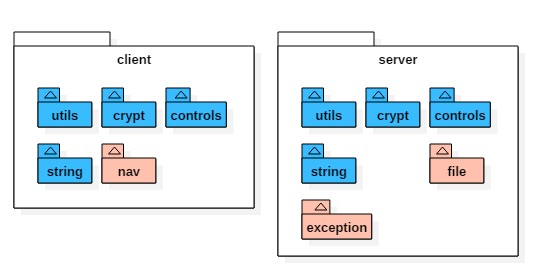

febs 库是一些常用的工具的合集;

`febs是在citong@2.0.8基础上进行开发, citong库已停止更新`

# Install

Use npm to install:

```js
npm install febs --save
```
  copy directory `node_modules/febs/dist/febs` to client



febs web库分为客户端与服务器端;

- 通用于客户端与服务端的库如下
  - [utils](#utils)
  - [string](#string)
  - [crypt](#crypt)
  - [controls](#controls)

- 客户端独有库
  - [nav](#nav)

- 服务端独有库
  - [exception](#exception)
  - [file](#file)

# 说明

> 客户端

使用时需依赖 `jquery`, `jquery.form` 这个两个库.
```js
<script src="jquery.min.js"></script>
<script src="jquery.form.min.js"></script>
<script src="febs.min.js" charset="UTF-8"></script>
```

> 服务端

服务端定义了如下一些全局变量
| name           | description |
|----------------|-------------|
| __line  | 当前所在行, 可以配合 __filename 定位错误日志   |
| console.debug  | development 环境下输出日志  |

> 其他
* 函数调用使用 `类名.xxx` 的方式调用, 例如: `febs.utils.browserIsMobile()` 
* 实现了部分控件, 网页模板在 `febs/client/partials` 路径下, 使用`handlebar`实现

# utils

utils库包含了一些常用的函数, 如判断浏览器是否是手机/时间字符串格式化等.

```js
/**
 * @desc: the browser is mobile.
 * @param userAgent: 在服务器调用时需传入客户端的userAgent
 */
browserIsMobile()
/**
 * @desc: the browser is ios.
 * @param userAgent: 在服务器调用时需传入客户端的userAgent
 */
browserIsIOS()
/**
 * @desc: the browser is phone.
 * @param userAgent: 在服务器调用时需传入客户端的userAgent
 */
browserIsPhone()
/**
 * @desc: the browser is weixin.
 * @param userAgent: 在服务器调用时需传入客户端的userAgent
 */
browserIsWeixin()
/**
 * @desc: the browser is support html5.
 */
browserIsSupportHtml5()  `服务端不支持`
```
```js
/**
 * @desc: 获取时间的string.
 * @param time: ms.
 * @param fmt: 格式化, 默认为 'HH:mm:ss'
 *             年(y)、月(M)、日(d)、12小时(h)、24小时(H)、分(m)、秒(s)、周(E)、季度(q)
 *              'yyyy-MM-dd hh:mm:ss.S' ==> 2006-07-02 08:09:04.423
 *              'yyyy-MM-dd E HH:mm:ss' ==> 2009-03-10 星期二 20:09:04
 *              'yyyy-M-d h:m:s.S'      ==> 2006-7-2 8:9:4.18
 * @param weekFmt: 星期的文字格式, 默认为 {'0':'星期天', '1': '星期一', ..., '6':'星期六'}
 * @return: string.
 */
getTimeString(time)
/**
 * @desc: getDate('2012-05-09')
 * @return: Date.
 */
getDate(strDate)
```
```js
/**
 * @desc: 合并多个map.
 * @return: {}
 */
mergeMap(...)
```
```js
/**
* @desc: 判断参数是否是null,undefined,NaN
* @return: boolean
*/
isNull(e)
/**
* @desc: 将异步回调方式的方法转换成promise, 函数中的this可以为指定值.
*         例如: yield denodeify(fs.exists)(path);
* @param self: 指定的调用对象
* @return: promise.
*/
denodeify(fn, self, argumentCount)   `仅服务端`
```

```js
// 大数运算.

/**
 * @desc: 判断是否是bigint.
 */
febs.utils.bigint_check(v)

/**
* @desc: calc bigint
* @return: bignumber.
*/
febs.utils.bigint_add(a, b)
febs.utils.bigint_minus(a, b)
febs.utils.bigint_dividedBy(a, b)
febs.utils.bigint_mul(a, b)
/**
* @desc: compare with bigint.
* @return: boolean.
*/
febs.utils.bigint_equal(a, b)
febs.utils.bigint_more_than(a, b)
febs.utils.bigint_more_than_e(a, b)   // more than or equal.
febs.utils.bigint_less_than(a, b)
febs.utils.bigint_less_than_e(a, b)   // less than or equal.
/**
* @desc: 转换bigint->string.
* @param fixed: 小数位个数, 默认为0.
* @return: string.
*/
febs.utils.bigint_toFixed(a, fixed)
```

# string
string 提供了一些js string对象缺少且较常使用的函数.
```js
/**
* @desc: 判断是否是手机号码.
* @return: boolean.
*/
isPhoneMobile(str)
/**
 * @desc: 是否为空串.
 * @return: boolean.
 */
isEmpty(s)
/**
 * @desc: 获得字符串utf8编码后的字节长度.
 * @return: u32.
 */
getByteSize(s)
/**
 * @desc: 替换字符串中所有的strSrc->strDest.
 * @return: string.
 */
replace(str, strSrc, strDest)
```

# crypt
目前提供了uuid,crc32,base64.
```js
/**
* @return 生成一个uuid字符串.
*/
uuid()
/**
 * @desc: 计算字符串的crc32值
 * @param crc 可以在这个值得基础上继续计算
 * @return: number.
 */
crc32( str, crc )
/**
 * @desc: 通过文件表单控件进行文件的crc32计算.
 * @param fileObj: 表单文件对象, 例如表单为:
 *                  <form enctype="multipart/form-data">
 *                    <input id="file" type="file" name="file" multiple>
 *                  </form>
 *             $('#file')[0].files[0] 即为第一个文件对象.
 * @param cb: function(crc32) {}; 计算出来的crc32通过回调函数返回
 */
crc32_file(fileObj, cb)    `客户端`
/**
 * @desc: 直接对文件进行计算.
 * @param filename: 文件路径
 * @return: number
 */
crc32_file(filename)    `服务端`
/**
* @desc: base64编码.
* @param arrByte: 字节数组.
* @return: string.
*/
base64_encode(arrByte)
/**
* @desc: base64解码.
* @return: 字节数组.
*/
base64_decode(strBase64)
```
# nav
导航是以ajax的方式进行页面切换
```js
/**
 * @desc: 使用跳转函数初始化.
 * @param navCallback: function(object); 触发页面切换时的回调.
 * @param urlObjEquelCallback: function(obj1, obj2) : bool; 判断两个页面是否相等.
 * @param options: {
                     defaultTimeout: 10000,
                   }
 * @return:
 */
nav_init(navCallback, urlObjEquelCallback, options)
/**
 * @desc: 跳转至指定位置.
 * @param urlObject: null则当前页面刷新.
 * @return:
 */
nav_go(urlObject)
/**
 * @desc: 刷新页面.
 */
nav_refresh()
/**
 * @desc 刷新指定元素.
 */
nav_refresh_elem(elem, url);
/**
 * @desc: ajax 跳转.
 * @param ctx:例如: (详见jquery.ajax)
    {
     type: "GET",
     url: url,
     data: null,
     success: cb
   }
 * @return:
 */
nav_ajax( ctx )
```


# exception
定义了服务端常用的错误类型.

    this.code = code;
    this.msg = msg;
    this.filename = filename;
    this.line = line;
```js
// @desc: 一般错误.
exception.ERROR
// @desc: 参数错误.
exception.PARAM
// @desc: 越界
exception.OUT_OF_RANGE
```
异常类如下
```js
/**
* @desc: 构造异常对象.
* @param msg: 异常消息
* @param code: 异常代码
* @param filename: 异常文件名
* @param line: 异常文件所在行
* @return: 
*/
exception(msg, code, filename, line)
```

# file
```js
/**
 * @desc: 判断文件夹是否存在.
 * @return: boolean.
 */
dirIsExist(dir)
/**
 * @desc: 保证文件夹存在.
 * @return: bool. 若不存在新建; 文件夹存在返回true.
 */
dirAssure(dir)
/**
 * @desc: 复制文件夹.
 * @param callback: (err) => {}, 执行此函数时表示复制完成.
 * @return: bool.
 */
dirCopy(src, dest, callback)
/**
 * @desc: 删除文件夹.
 * @return:bool.指明是否删除.
 */
dirRemoveRecursive(dir)
/**
 * @desc: 获得文件的字节大小.
 * @return: number.-1表示错误.
 */
fileSize(file)
/**
 * @desc: 判断文件是否存在.
 * @return: boolean.
 */
fileIsExist(file)
/**
 * @desc: 复制文件.
 * @param callback: (err) => {}, 执行此函数时表示复制完成.
 * @return: bool.
 */
fileCopy(src, dest, callback)
/**
 * @desc: 移除文件.
 * @return: bool.指明是否删除.
 */
fileRemove(file)
```


# controls

### loading


```js
/**
 * Example:
 *      前台引入:
 *          1. control_loading.hbs页面
 *          2. 使用脚本
 *              // 使用延时显示加载框.
 *              control_loading_show(text, timeout);
 *
 *              // 通过文本改变方式显示加载框.
 *              // changeTextCB: 设置文本的函数. elemFunc(text)
 *              // textArray: 变化的文本数组.
 *              // hideCB:  隐藏加载框时的设置文本的函数. hideCB().
 *              control_loading_show_text(textArray, changeTextCB, hideCB);
 *            
 *              // 隐藏加载框.
 *              control_loading_hide();
 */
 ```

### page

```js
/**
* Example:
*      前台引入:
*          1. 在需要page的页面上引入 control_page.hbs页面
*          2. 实现脚本: control_page_to(page); 当分页按钮被点击时将执行此函数.
*      后台:
*          1. var ctx = require('febs').controls.page.renderCtx(curPage, pageCount, totalCount);
*          2. 将ctx加入到render ctx中即可.
*/
```

### upload
```js
/**
 * Desc:
 *      upload控件使用一个接口来上传文件, 使用multpart/form-data方式传输:
 *          1. uploadUrl: 上传文件.
 * Example:
 *      前台引入:
 *          1. 在需要upload的页面上引入 control_upload.hbs页面; 或者使用如下语句:
 *                <form method="post" role="form" enctype="multipart/form-data" id="fileForm">
 *                  <input type="file" class="form-control" name="file" onchange="febs.controls.upload(cfg)" multiple>
 *                </form>
 *      后台:
 *          1. 在uploadUrl中调用  yield require('febs').controls.upload.accept(app, conditionCB); 当满足条件时将存储, 并返回true表示成功.
 *
 *
 *
 * 客户端.
 ** 需要 jquery,jquery.form 库支持.
  * 并且 <input type="file" name="file"... 中, 必须存在name属性.
  * 使用post方式上传文件.
  * @param cfg:  object, 其中
  *              {
  *                data:       , // 上传到服务器的任意字符串数据.
  *                formObj:    , // 含有enctype="multipart/form-data"的form
  *                fileObj:    , // form中的file对象
  *                uploadUrl:  , // 上传文件内容的url. 系统将自动使用 uploadUrl?crc32=&size=的方式来上传.
  *                maxFileSize:    , // 允许上传的最大文件.0表示无限制.默认为0
  *                fileType:     , // 允许的文件类型.  如: image/gif,image/jpeg,image/x-png
  *                finishCB:    , // 上传完成后的回调. function(err, fileObj, serverData)
  *                               //                   err:  - 'no file'      未选择文件.
  *                               //                         - 'size too big' 文件太大.
  *                               //                         - 'check crc32 err' 计算本地文件hash值时错误.
  *                               //                         - 'ajax err'     ajax上传时出错.
  *                               //                   serverData: 服务器返回的数据.
  *                progressCB:  , // 上传进度的回调. function(fileObj, percent)
  *              }
  * function control_upload(cfg)
  *
 * 服务端.
  ***
  * 接收上传文件内容.
  * @param conditionCB: function*(data, filesize, filename, filemimeType):string.
  *                      - data: 上传的附加数据.
  *                      - filesize: 将要存储的文件大小.
  *                      - filename: 上传的文件名.
  *                      - filemimeType: 文件类型, 例如: 'image/jpeg'.
  *                      - return: 存储的文件路径, 返回null表示不存储.
  * @return boolean.
  *
  * function *accept(app, conditionCB)
  */
```
完整例子
后台:
```js
exports.upload = function*(next)
{
  var r = yield require('febs').controls.upload.accept(this, function*(data, filesize, filename, filemimeType){
    console.log(filesize);
    console.log(filename);
    console.log(filemimeType);

    return 'tempPath/temp.filename';
  });
};

```
前台:
```js
<script type="text/javascript" charset="utf-8" src="/jquery/jquery.min.js"></script>
<script type="text/javascript" charset="utf-8" src="/jquery/jquery.form.min.js"></script>

<script type="text/javascript">
function upload() {
  febs.controls.upload({
    formObj:  $('#fileForm'),
    fileObj:  $("#filec"),
    uploadUrl:  '/uploadFile',
    finishCB: function(err, fileObj, serverData){
      console.log(serverData);
    },
    progressCB: function(fileObj, percent){
      console.log(percent);
    })
  });

}
</script>

<form method="post" role="form" enctype="multipart/form-data" id="fileForm">
  <input id="filec" type="file" name="file" onchange="javascript:upload()" multiple>
</form>
```
